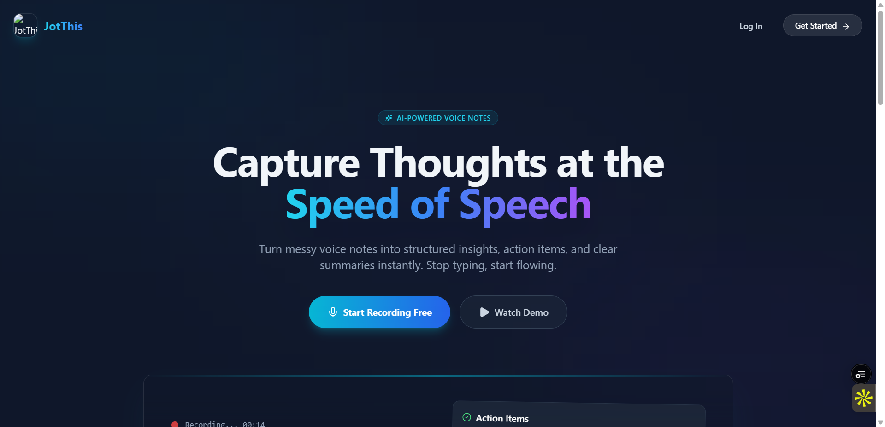

# JotThis - AI Voice Notes



> Transform your voice notes into structured insights with AI-powered transcription and analysis.

## 🎯 Project Overview

**JotThis** is a modern voice-to-text application that records audio, transcribes it using OpenAI Whisper, and provides AI-powered insights using GPT-4. Built with Next.js 15, Firebase, and OpenAI APIs, it offers a premium, app-like experience on the web.

**Current Status:** 🟢 Production Ready
- ✅ **Secure Auth**: Email/Password & Google Sign-in with anonymous guest access.
- ✅ **AI Transcription**: High-accuracy speech-to-text using OpenAI Whisper.
- ✅ **AI Analysis**: Auto-generates titles, tags, action items, research topics, and content ideas using GPT-4o.
- ✅ **Smart Organization**: Search, Favorites, Archive, Trash, and Tag Cloud with AI clustering.
- ✅ **Data Protection**: Lock important notes to prevent accidental deletion.
- ✅ **Cloud Sync**: All data securely stored and synced via Firebase Firestore & Storage.

---

## 🚀 Features

### 🎙️ Capture & Transcribe
- **One-Tap Recording**: Simple, intuitive interface with sine-wave audio visualization.
- **Whisper Integration**: State-of-the-art transcription accuracy.
- **Auto-Title & Tag**: Context-aware titles and tags generated automatically.

### 🧠 AI Insights
- **Deep Analysis**: Convert raw transcripts into structured lists:
  - 📋 **Action Items**: To-do lists extracted from your ramblings.
  - 💡 **Content Ideas**: Blog posts, tweets, or video concepts based on your notes.
  - 🔍 **Research Topics**: Key terms and concepts to explore further.
- **Smart Tagging**: AI organizes your tags into semantic clusters (e.g., "Work", "Ideas") with color-coding.

### ⚡ Productivity Tools
- **Text-to-Speech**: Listen to your notes with premium AI voices (Alloy, Echo, etc.) and smart caching for instant playback.
- **Lock Notes**: Prevent accidental deletion of critical information.
- **Note Sharing**: Generate secure, public links to share notes with anyone.
- **Multiselect**: Bulk actions to Favoritie, Archive, or Trash multiple notes at once.
- **Search**: Real-time filtering by title, transcript, or tags.
- **Archive & Trash**: Soft delete and archival workflows to keep your workspace clean.

---

## 🛠️ Architecture

### Tech Stack
| Layer | Technology |
|-------|-----------|
| **Framework** | Next.js 15 (App Router) |
| **Language** | TypeScript |
| **Styling** | Tailwind CSS + DaisyUI |
| **Animations** | Framer Motion |
| **Auth** | Firebase Authentication |
| **Database** | Cloud Firestore |
| **Storage** | Firebase Storage |
| **AI** | OpenAI Whisper & GPT-4o-mini |

### Data Security
- **Row-Level Security**: Firestore and Storage rules ensure users can only access their own data.
- **Secure Sharing**: Shared notes are verified via backend tokens; unshared notes remain private.
- **Lock Protection**: Backend rules strictly enforce "Lock" status, preventing deletion even via API.

---

## 🚀 Quick Start

### Prerequisites
- Node.js 18+ 
- Firebase Project
- OpenAI API Key

### 1. Install Dependencies
```bash
npm install
```

### 2. Configure Environment Variables
Create `.env` based on `.env.example`:

```bash
# Firebase (Client)
NEXT_PUBLIC_FIREBASE_API_KEY=...
NEXT_PUBLIC_FIREBASE_AUTH_DOMAIN=...
NEXT_PUBLIC_FIREBASE_PROJECT_ID=...
# ... other Firebase config

# OpenAI (Server)
OPENAI_API_KEY=sk-...
```

### 3. Run Development Server
```bash
npm run dev
```
Open [http://localhost:3000](http://localhost:3000)

---

## 🔐 Security Rules

**Firestore:**
```javascript
match /users/{userId}/transcriptions/{noteId} {
  allow read, write: if request.auth.uid == userId;
  // Locked notes cannot be deleted
  allow delete: if request.auth.uid == userId && resource.data.isLocked != true;
}
```

**Storage:**
```javascript
match /users/{userId}/audio/{fileName} {
  allow read, write: if request.auth.uid == userId;
}
```

---

## 📄 License

**Proprietary Software**
Copyright © 2026. All Rights Reserved.
Unauthorized copying, modification, distribution, or use of this software is strictly prohibited.

---
